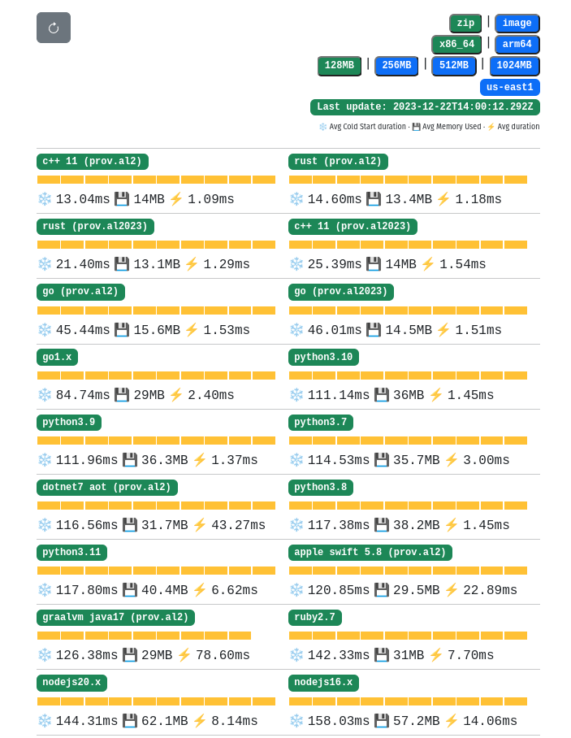
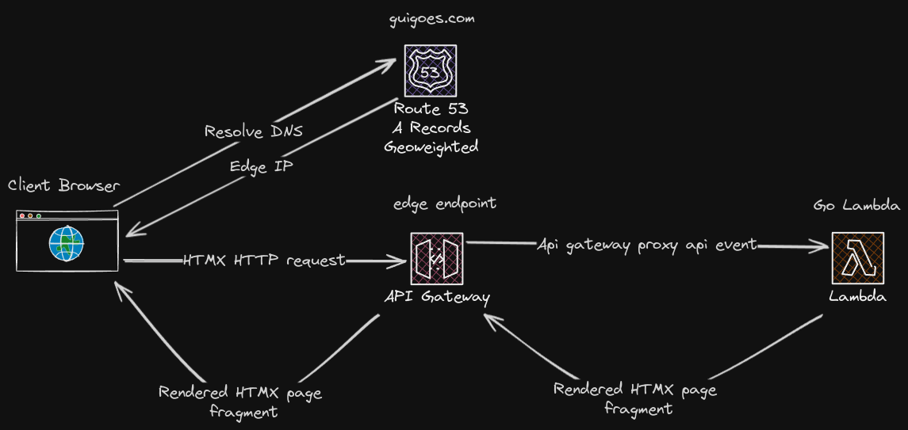

# Criando um Blog com Golang, HTMX e AWS Lambda

Neste artigo, vou compartilhar minha experiência na criação deste blog usando Golang e HTMX, rodando tudo em uma AWS Lambda.

Essa é uma stack que recentemente vem ganhando bastante popularidade, principalmente entre os devs que, como eu, tem uma carreira mais focada em backend.

# Sobre HTMX

[HTMX](https://htmx.org/) é uma biblioteca JavaScript bem compacta (+/- 14kb) que sua webapp precisa importar, ela extende as funcionalidades basicas do HTML e dá acesso a funcionalidades como AJAX, SSE e WebSockets para qualquer elemento dos seus documentos de hypertexto.

```html
<script src="https://unpkg.com/htmx.org@1.9.10"></script>

<!-- Um botão que não está associado a nenhum form pode 
realizar uma requisição HTTP!!! -->
<button hx-post="/clicked" hx-swap="outerHTML">
Enviar
</button>
```

A vantagem dessa abordagem é que você fica livre para usar sua linguagem de preferência no backend, desde que as respostas do servidor sejam documentos HTMX válidos, tá tudo certo 👌. 

Conseguir criar interfaces modernas diretamente do conforto do backend da bastante produtivade para devs que não estão acostumados com as idiossincrasias do mundo JavaScript.

## Por que golang?

HTMX permite usar o backend que você preferir, a escolha de golang é mais pessoal do que qualquer coisa, mas mesmo assim, há algumas vantagens em usar Go com HTMX 👇

 - Baterias incluidas: A biblioteca padrão do go já vem com a maior parte dos pacotes necessários para criar um webserve;
 - Templates: O pacote padrão [html/template](https://pkg.go.dev/html/template) facilita muito a renderização de templates HTML, mas há uma opção ainda melhor que é a biblioteca [templ](https://templ.guide/) que permite criar templates com checagem estática de tipos;
 - Go compila super rápido, isso dá velocidade para realizar mudanças no código;
 
 E o mais importante para os leitores desse blog, Go tem um dos melhores cold starts e uso de memória em AWS Lambdas, perdendo somente para linguagens sem garbage collector como Rust e C++:


> Análise diária de cold start de várias runtimes suportadas em AWS Lambda @ https://maxday.github.io/lambda-perf/

Isso garante uma ótima performance no carregamento das páginas do blog com baixo investimento de minha parte na infraestrutura do site, win win!

## Arquitetura



A arquitetura do blog em sí é bastante simples

### Golang

Golang, ou Go, é uma linguagem de programação eficiente e fácil de aprender. Sua concorrência incorporada e desempenho tornam Golang uma escolha popular para desenvolvedores que buscam criar aplicativos rápidos e eficientes.

### HTMX

HTMX é uma biblioteca JavaScript que simplifica a construção de aplicativos web interativos. Ele permite a atualização de partes específicas de uma página HTML, eliminando a necessidade de recarregar a página inteira. Essa abordagem resulta em uma experiência do usuário mais rápida e suave.

### Bleve

Bleve é uma biblioteca em Go para indexação e busca de texto completo. É útil para implementar uma pesquisa poderosa em grandes conjuntos de dados de texto, como posts de blog. A integração do Bleve pode melhorar significativamente a experiência do usuário ao fornecer resultados de pesquisa precisos e rápidos.

### AWS Lambda e API Gateway

AWS Lambda permite executar código sem a necessidade de provisionar ou gerenciar servidores. Integramos nossa aplicação de blog com Lambda para garantir escalabilidade e eficiência.

O API Gateway atua como um proxy HTTP, permitindo o acesso fácil aos nossos serviços Lambda através da web.

### AWS CDK

AWS CDK (Cloud Development Kit) é uma ferramenta que permite definir infraestrutura como código (IaC). Utilizamos o CDK para simplificar o processo de deploy da nossa aplicação na AWS.

## Estrutura da Aplicação

A aplicação é dividida em duas partes principais: a lógica de backend, implementada em Golang, e a interface de usuário, construída com HTML e HTMX.

A busca full text é habilitada pelo Bleve, que indexa e fornece resultados de pesquisa eficientes. A comunicação entre o frontend e o backend é gerenciada pelo HTMX, garantindo uma experiência do usuário suave.

A integração com a AWS Lambda e o API Gateway permite que o blog seja acessado facilmente pela web. O AWS CDK automatiza o processo de deploy, tornando-o simples e eficiente.

## Deploy da Aplicação

O AWS CDK simplifica o deploy da aplicação. Basta executar alguns comandos para implantar o backend, configurar o API Gateway e criar a função Lambda. A escalabilidade é garantida pela natureza serverless da AWS Lambda.

## Conclusão

Este artigo fornece uma visão geral do processo de criação de um blog moderno usando Golang, HTMX e AWS Lambda. Essas tecnologias, combinadas com a eficiência do Bleve e a facilidade de deploy proporcionada pelo AWS CDK, resultam em um blog escalável e rápido, com uma experiência do usuário aprimorada. Experimente essas ferramentas em seu próximo projeto e aproveite os benefícios de uma arquitetura moderna e eficiente.