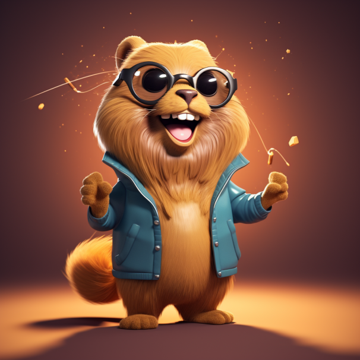

# Home page

## Golang's gopher mascot Midjourney hallucination



> Kinda cute though!

```golang
import (
  "context"
  "fmt"
  "math/rand"
 
  "github.com/OrenRosen/gokit-example/article"
)

type ArticlesRepository interface {
   GetArticle(ctx context.Context, id string) (article.Article, error)
   InsertArticle(ctx context.Context, thing article.Article) error
}

type service struct {
   repo ArticlesRepository
}

func NewService(repo ArticlesRepository) *service {
   return &service{
      repo: repo,
   }
}

func (s *service) GetArticle(ctx context.Context, id string) (article.Article, error) {
   return s.repo.GetArticle(ctx, id)
}

func (s *service) CreateArticle(ctx context.Context, artcle article.Article) (id string, err error) {
   artcle.ID = generateID()
   if err := s.repo.InsertArticle(ctx, artcle); err != nil {
      return "", fmt.Errorf("publishing.CreateArticle: %w", err)
   }
   
   return artcle.ID, nil
}

func generateID() string {
  // code emitted
}
```