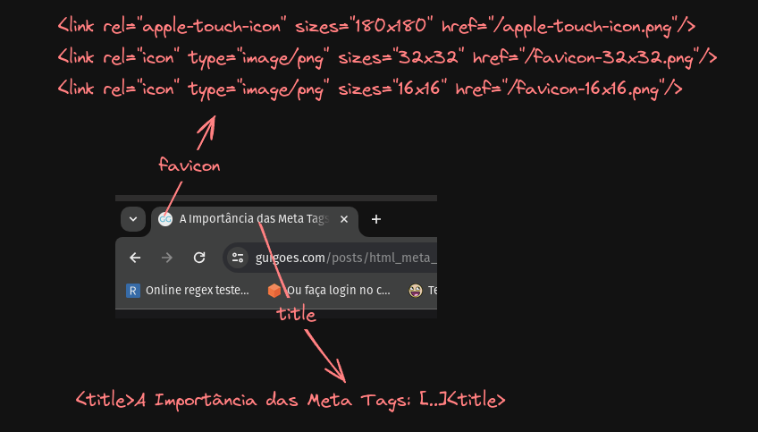

# A Importância das Meta Tags: Impulsionando SEO, Redes Sociais e Taxa de Cliques

Se você planeja criar conteúdo compartilhável para a internet, as meta tags desempenham um papel vital, influenciando diretamente a visibilidade nos motores de busca e a apresentação do conteúdo nas redes sociais. Ao adicionar meta tags, os desenvolvedores podem não apenas melhorar o SEO, mas também aumentar significativamente a Taxa de Cliques (CTR - Click Through Rate) por meio de uma representação mais atrativa e informativa nas plataformas online.

## Tá, mas que diabos são meta tags?

Todo documento HTML tem uma tag especial ```<head>``` que todo web dev já viu pelo menos uma vez. O uso mais comum dessa tag é para definir o título da página, algumas configurações de exibição e os recursos como scripts e estilos que serão usado na página.

```html
<head>
    <title>A Importância das Meta Tags: Impulsionando SEO, Redes Sociais e Taxa de Cliques<title>
    <script src="https://unpkg.com/htmx.org@1.9.9" integrity="sha384-QFjmbokDn2DjBjq+fM+8LUIVrAgqcNW2s0PjAxHETgRn9l4fvX31ZxDxvwQnyMOX" crossorigin="anonymous"></script>
    <link rel="stylesheet" href="/output.css" defer/>
    <link rel="apple-touch-icon" sizes="180x180" href="/apple-touch-icon.png"/>
    <link rel="icon" type="image/png" sizes="32x32" href="/favicon-32x32.png"/>
    <link rel="icon" type="image/png" sizes="16x16" href="/favicon-16x16.png"/>
</head>
```
O efeito dessas tags vai de navegador para navegador, de dispositivo para dispositivo, mas no chrome no desktop deve renderizar algo assim:



A tag ```head``` pode receber tags do tipo ```<meta>```, que são dados sobre a página que seu navegador está tentando renderizar, por exemplo, o encoding do texto. Vamos nos ater ao quesito de como elas influenciam a visualização de um artigo compartilhado em plataformas.

Existe um classe de meta tags que podem ser usadas para influenciar ativamente como um link compartilhado vai ser exibido nas redes sociais, essas tags basicamente ajudam o web scrapper da plataforma coletar informações da página e gerar um preview:


## Por que as Meta Tags são melhoram a Taxa de Cliques?

1. **Apresentação Atraente nas Redes Sociais:** As meta tags, especialmente aquelas projetadas para plataformas como Facebook, LinkedIn e Twitter, influenciam diretamente a forma como um link é exibido ao ser compartilhado. Uma representação visualmente atraente, com título, descrição e imagem relevantes, aumenta a probabilidade de os usuários clicarem.

2. **Informações Relevantes e Concisas:** Meta tags como a meta descrição oferecem uma oportunidade única de apresentar uma descrição concisa e envolvente do conteúdo da página. Isso permite que os usuários entendam rapidamente do que se trata o link, o que é crucial para a decisão de clicar.

3. **Destaque nos Resultados de Busca:** Meta tags bem otimizadas também afetam diretamente a exibição nos resultados de pesquisa. Um título cativante e uma descrição informativa podem destacar uma página em meio a muitos outros resultados, aumentando as chances de clique.

## Open Graph (OG)

O Open Graph é um protocolo desenvolvido pelo Facebook para permitir que páginas da web tenham um controle mais preciso sobre a forma como seu conteúdo é exibido quando compartilhado na plataforma. Essencialmente, o Open Graph fornece um conjunto de meta tags que os desenvolvedores podem incorporar no código HTML de suas páginas para especificar títulos, descrições, imagens e outros elementos relevantes ao compartilhar links no Facebook.

O objetivo principal do Open Graph é melhorar a experiência de compartilhamento de conteúdo online. Ao utilizar as meta tags do Open Graph, os desenvolvedores podem influenciar a aparência dos links compartilhados, garantindo que o título, a descrição e a imagem associados à página sejam apresentados de maneira atraente.

Além do Facebook, outras plataformas de mídia social também reconhecem e utilizam o Open Graph para exibir informações consistentes e visualmente atraentes ao compartilhar links. Isso inclui o LinkedIn, Twitter e outras redes que adotaram esse protocolo para padronizar a apresentação de conteúdo compartilhado.

Exemplo das meta tags básicas Open Graph mais importantes:

```html
    <meta property="og:title" content="Título da Página">
    <meta property="og:description" content="Descrição breve do conteúdo da página">
    <meta property="og:image" content="URL da imagem">
    <meta property="og:url" content="URL da Página">
    <meta property="og:type" content="Tipo do conteúdo">
````

O Open Graph oferece meta tags específicas para diferentes tipos de mídia, como vídeo e imagens. Essas tags permitem que os desenvolvedores forneçam informações detalhadas sobre o conteúdo multimídia associado à página. Abaixo estão algumas das principais meta tags do Open Graph para tipos específicos de mídia:

```html
<meta property="og:video" content="URL do vídeo">
<meta property="og:video:secure_url" content="URL segura do vídeo">
<meta property="og:video:type" content="application/mp4">
<meta property="og:video:width" content="Largura do vídeo">
<meta property="og:video:height" content="Altura do vídeo">
<meta property="og:image" content="URL da imagem">
<meta property="og:image:secure_url" content="URL segura da imagem">
<meta property="og:image:type" content="image/jpeg">
<meta property="og:image:width" content="Largura da imagem">
<meta property="og:image:height" content="Altura da imagem">
````

## Twitter (X)

Se seu conteúdo pode ser associado com alguma conta do Twitter, é boa prática incluir as tags proprietárias da plataforma:

```html
    <meta name="twitter:site" content="@conta">
    <meta name="twitter:creator" content="@conta">
```

O Twitter adota algumas das tags Open Graph que vão ajudar a gerar cards de artigos simples, mas para conteúdos multimídia a maior parte são proprietárias, nesse [link](https://developer.twitter.com/en/docs/twitter-for-websites/cards/overview/markup) é possível quais tags OG são reaproveitadas e as opções disponíveis.

## Google

Em 2009, o Google anunciou oficialmente que o uso de meta tags, especificamente a meta tag de palavras-chave, não tinha mais influência significativa no processo de indexação de páginas. Isso significa que o Google não usa diretamente as meta tags de palavras-chave para determinar a relevância e classificação de uma página nos resultados de pesquisa.

No entanto, é importante notar que outras meta tags, especialmente aquelas relacionadas ao Open Graph para redes sociais e aquelas que fornecem informações sobre o conteúdo da página, continuam desempenhando um papel importante. Embora o Google não dependa exclusivamente dessas meta tags para indexação, elas ainda podem ter impacto nas SERPs (páginas de resultados de pesquisa) de várias maneiras.

Por exemplo, meta tags como o título (meta title) e a descrição (meta description) são frequentemente exibidas nos resultados de pesquisa, influenciando diretamente a decisão dos usuários de clicar ou não em um link. Um título cativante e uma descrição informativa podem melhorar a Taxa de Cliques (CTR) e, consequentemente, a visibilidade da página.

Assim, enquanto o papel das meta tags evoluiu ao longo dos anos no contexto do algoritmo de busca do Google, elas ainda desempenham um papel significativo na apresentação e na experiência do usuário nas SERPs, além de continuarem sendo cruciais para otimização em redes sociais e outros contextos online.

## Conclusão

Ao incorporar meta tags, os desenvolvedores não apenas otimizam para motores de busca, mas também aprimoram a experiência do usuário nas redes sociais, resultando em uma melhoria significativa na Taxa de Cliques. O cuidado na criação dessas tags é essencial para garantir que o conteúdo seja não apenas encontrado, mas também escolhido pelos usuários ao interagir online.

*Fontes:*
- Moz. "Meta Tags that Google Understands." Disponível em: https://moz.com/learn/seo/meta-description
- Facebook for Developers. "Sharing Best Practices for Websites." Disponível em: https://developers.facebook.com/docs/sharing/best-practices/
- Twitter Developer. "Cards Markup." Disponível em: https://developer.twitter.com/en/docs/twitter-for-websites/cards/guides/getting-started