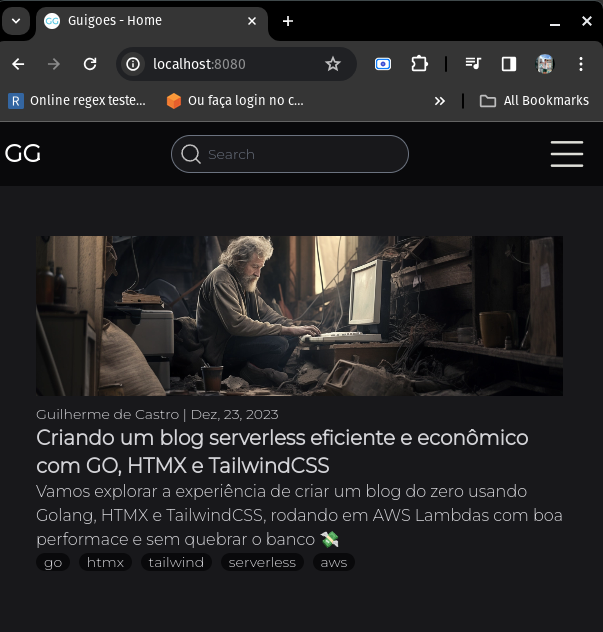

# Guigoes - A serverless blog using GO and HTMX

This is the base code in which my blog guigoes.com runs, it was built using Go and HTMX runs efficiently on AWS Lambda.

## Table of Contents

- [Introduction](#introduction)
- [Features](#features)
- [Technologies Used](#technologies-used)
- [Getting Started](#getting-started)
  - [Installation](#installation)
  - [Usage](#usage)
  - [Deploy](#deploy)
- [Contributing](#contributing)
- [License](#license)

## Introduction

I wanted to create and reasonably performant blog that is cheap to run and serverless. Go and HTMX was a perfect fit for this, as Go runs great on AWS Lambdas and server rendered pages is as good as it gets performance wise on the web.

## Features

- Responsive design
- Full-text search
- Markdown to HTML parsing for blog posts
- Easy deploy on AWS

## Technologies Used

- Go - https://github.com/golang/go
- TailwindCSS (standalone CLI) - https://github.com/tailwindlabs/tailwindcss 
- AWS CDK - https://github.com/aws/aws-cdk
- Gin - https://github.com/gin-gonic/gin
- HTMX - https://github.com/bigskysoftware/htmx
- Templ - https://github.com/a-h/templ
- Goldmark - https://github.com/yuin/goldmark
- Bleve - https://github.com/blevesearch/bleve

## Getting Started

You will need 
1. Go 1.1.8 or later
1. Node.js 14.15.0 or later.
3. Make

### Installation

```bash
$ git clone hhttps://github.com/guilycst/guigoes
$ cd guigoes
$ make install
``````

```make install``` will run the shell script [install.sh](./install.sh) to install some of the dependencies needed to run and build locally:

- [TailwindCSS](https://tailwindcss.com/) - CSS Framework
- [Air](https://github.com/cosmtrek/air) - Live reloading
- [Templ](https://templ.guide/) - HTML templating language for Go
- [AWS CDK](https://docs.aws.amazon.com/cdk/v2/guide/getting_started.html) - Amazon cloud development kit

This step will also run ```go mod tidy``` and ```go mod download``` so all dependencies are available to run the project.

### Usage

First you'll need to change the POSTS_PATH entry on the .env file so it points correctly to the posts dir on this repository

```environment
POSTS_PATH="PATH_TO_REPO_HERE/posts/" 
DIST_PATH="./web/dist/"
BLEVE_IDX_PATH="blog.bleve"
```

Then you can run using ```$ make run```, this will start a local web server at port :8080 with live reloading using air, so changes made to the code should reflect automatically.




### Deploy

This project was meant to be deployed on AWS Lambda, and for that end AWS CDK was used.

```$ make deploy``` will try to deploy to AWS using your your local credentials if available

This should provision all resources on your AWS account and make it available through an API Gateway endpoint. If the deploy step runs correctly there should be an output named **API-Gateway-Endpoint**

### License
[GNU GENERAL PUBLIC LICENSE Version 3](./LICENSE)

